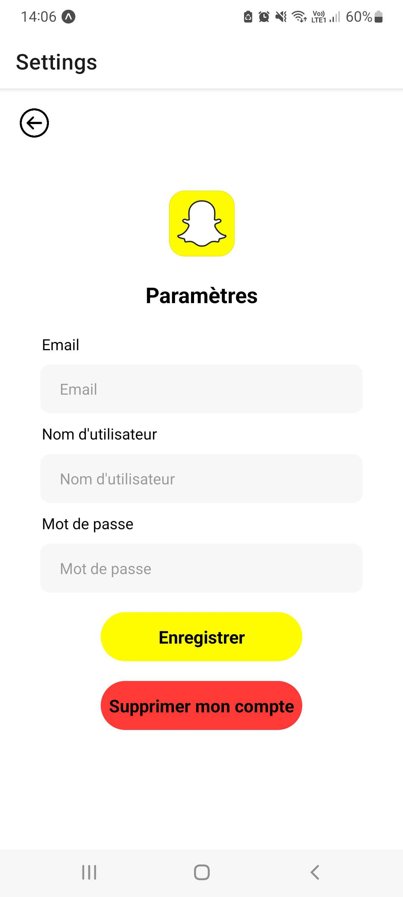
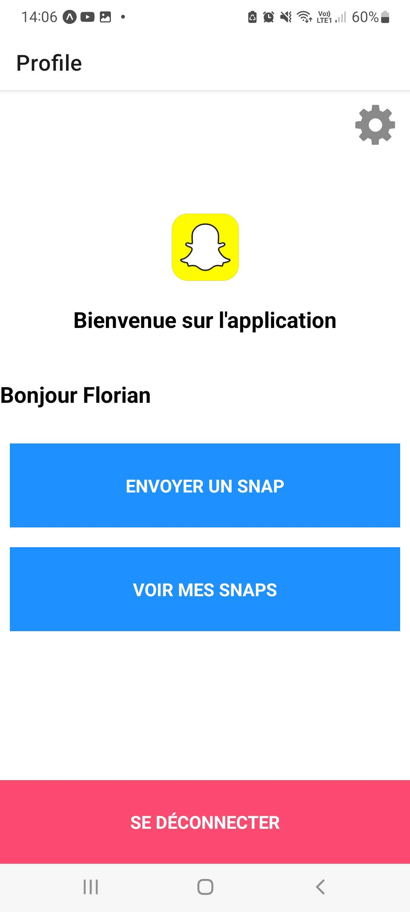

# Snapchat

## Introduction

👋 Bienvenue !

Dans ce projet à réaliser en 1 semaine et par groupe de 2,

Nous devons utiliser une API et React Native pour créer une application portable qui reproduit les fonctionnalités principales de Snapchat.

## Fonctionnalités

- Créer un compte et se connecter
- Page de profil
- Modifier et supprimer le compte
- Prendre une photo ou choisir depuis la galerie
- Afficher la liste des utilisateurs

## Captures d'écran

